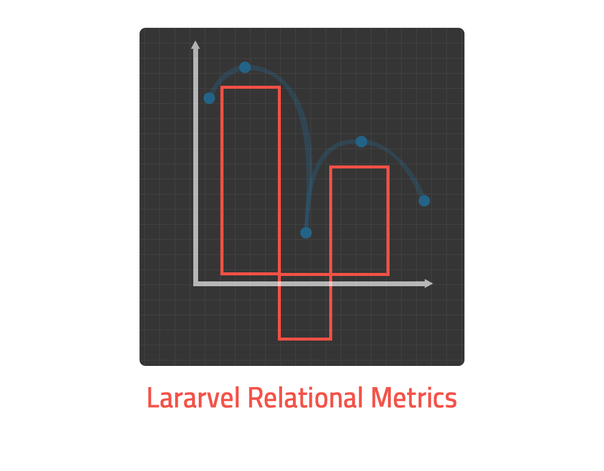

[](https://github.com/syrian-open-source/laravel-multi-process/actions/workflows/php.yml)
[](https://github.com/syrian-open-source/laravel-multi-process/actions/workflows/tests.yml)


# Relational Metrics
This package will help you to make your metrics easier, You could get metrics about your Models, Models depending on their relations, or even metrics about your models depending on multiple conditions!!

It would be a very easy to get the number of your stores which has products has a price more than x$ ;)

##### 1 - Dependency
The first step is using composer to install the package and automatically update your composer.json file, you can do this by running:

```shell
composer require syrian-open-source/laravel-relational-metrics
```


Usage
---------
The Basic Usage of this package is the same of getting count of some model instances, but with a styled response 

```php
        $instance = (new \SOS\RelationalMetrics\Classes\RelationalMetrics("ModelName")); 
        // example: (new \SOS\RelationalMetrics\Classes\RelationalMetrics("Store"));
        // or you can specify thr model name by this way:  new RelationalMetrics(Store::class);
        $metrics = $instance->getBasicMetrics();
        // or you can get the count or the message directly.
        $directCount = $instance->getCount(); 
        $directName = $instance->getName(); 

        /*
	  *     Response will be like:
	  *	[
	  *	    'name' => 'Total Stores Number,
	  *	    'count' => 43,
	  *	];
	  *	
        */
```
What you can do next, you could get the metrics of a model depending on one of its relations!

Let's assume we want to get the number of stores that has products with price more than 500

```php
        $instance = (new \SOS\RelationalMetrics\Classes\RelationalMetrics("ModelName")); 
        // example: (new \SOS\RelationalMetrics\Classes\RelationalMetrics("Store"));
        // or you can specify thr model name by this way:  new RelationalMetrics(Store::class);
        $metrics = $instance->getRelationalMetrics($relationName, $relationColumn, $value);
        // example: $instance->getRelationalMetrics('products, 'price', 500);
        /*
	  *     Response will be like:
	  *	[
	  *	    'name' => 'Total Stores Number,
	  *	    'count' => 12,
	  *	];
	  *	
        */
```
At the previous Example the Package will return the number of the stores which has products with price equals to 500


And last but not least, You could get the metrics about a model depending on any number of conditions you want!


```php
        $instance = (new \SOS\RelationalMetrics\Classes\RelationalMetrics("ModelName")); 
        // example: (new \SOS\RelationalMetrics\Classes\RelationalMetrics("Store"));
        // or you can specify thr model name by this way:  new RelationalMetrics(Store::class);
        // example for the conditions
        $conditions = [
                  ['method' => 'where', 'column' => 'address', 'operator' => 'like', 'value' => '%UAE%'],
                  ['method' => 'where', 'column' => 'rate', 'operator' => '>', 'value' => 3],
        ];
        $metrics = $instance->getRelationalMetrics($conditions);
        	
        /*
	  *     Response will be like:
	  *	[
	  *	    'name' => 'Total Stores Number,
	  *	    'count' => 2,
	  *	];
	  *	
        */
```
At the previous Example the Package will return the number of the stores where their address contains "UAE" and their rate is more than 3


Changelog
---------
Please see the [CHANGELOG](https://github.com/syrian-open-source/laravel-relational-metrics/blob/master/CHANGELOG.md) for more information about what has changed or updated or added recently.

Security
--------
If you discover any security related issues, please email them first to zainaldeenfayod@gmail.com, 
if we do not fix it within a short period of time please open a new issue describing your problem. 

Credits
-------
* [Zain Aldeen Fayod](https://www.linkedin.com/in/zainaldeenfayod/)
* [All contributors](https://github.com/syrian-open-source/laravel-relational-metrics/graphs/contributors)

Package Logo by 
-------
* [Abdussalam Al-Ali](https://github.com/abdussalam-alali)

About Syrian Open Source
-------
The Syrian Open Source platform is the first platform on GitHub dedicated to bringing Syrian developers from different cultures and experiences together, to work on projects in different languages, tasks, and versions, and works to attract Syrian developers to contribute more under one platform to open source software, work on it, and issue it with high quality and advanced engineering features, which It stimulates the dissemination of the open-source concept in the Syrian software community, and also contributes to raising the efficiency of developers by working on distributed systems and teams.
